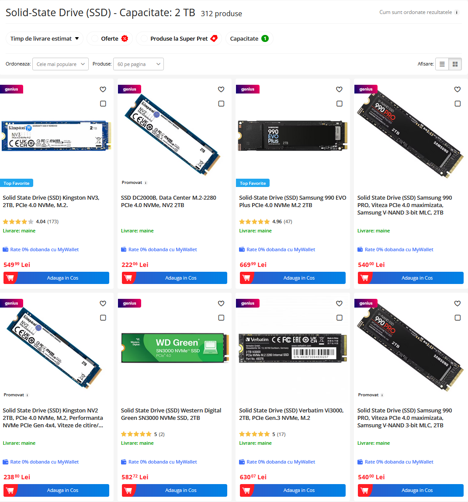
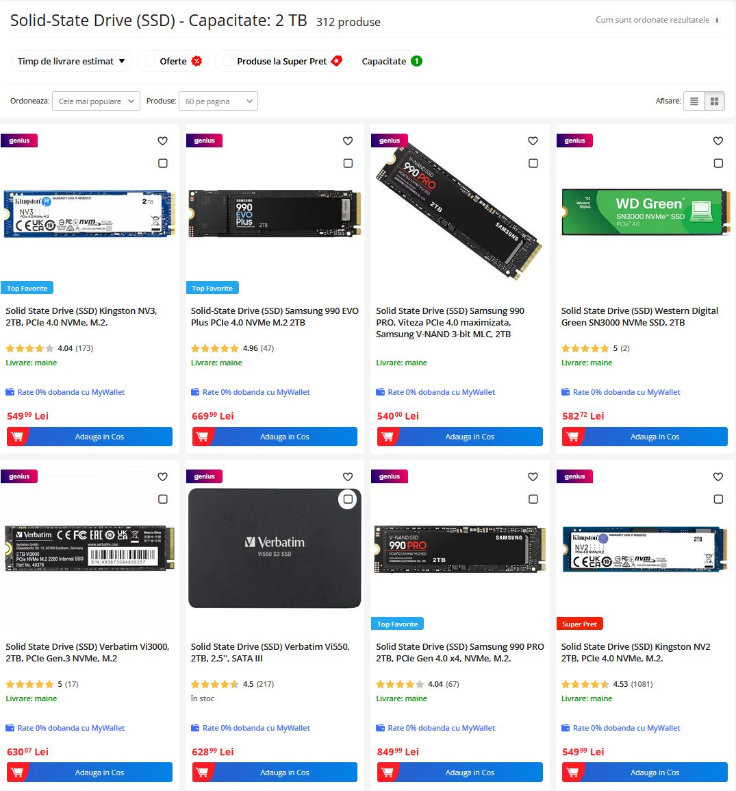

# eMag Promoted Products Remover

A userscript that automatically removes promoted/sponsored products from eMag search results and product listings across all eMag domains.

## 🌍 Supported Sites

- eMag Romania (emag.ro)
- eMag Bulgaria (emag.bg) 
- eMag Hungary (emag.hu)

## ✨ Features

- **Multilingual Support**: Detects promoted products in Romanian, Bulgarian, Hungarian, and English
- **Real-time Filtering**: Automatically removes promoted products as they load
- **Performance Optimized**: Uses debouncing and smart DOM observation
- **Error Resistant**: Continues working even if eMag changes their layout

## 🚀 Installation

### Prerequisites
You need a userscript manager extension:
- **Recommended**: [Violentmonkey](https://violentmonkey.github.io/) (Chrome, Firefox, Edge)
- **Alternative**: [Tampermonkey](https://www.tampermonkey.net/) (Chrome, Firefox, Safari, Edge)
- **Firefox**: [Greasemonkey](https://addons.mozilla.org/firefox/addon/greasemonkey/)

### Install the Script
1. Install a userscript manager (see above)
2. Click this link to install: **[Install eMag Promoted Remover](https://raw.githubusercontent.com/Hillev/emag-remove-promoted/main/emag-remove-promoted.user.js)**
3. Your userscript manager will open - click "Install"
4. Visit any eMag site and the script will automatically start working

### Manual Installation
1. Copy the contents of `emag-remove-promoted.user.js`
2. Open your userscript manager
3. Create a new script and paste the code
4. Save and enable the script

## 🖼️ Screenshots

### Before

### After  

## 🔧 How It Works

The script:
1. Monitors the page for product cards (`.card-v2`)
2. Checks each card for promotion badges (`.card-v2-badge-cmp`)
3. Removes cards containing promotional keywords in any supported language:
   - **Romanian**: promovat, promotat, sponsorizat
   - **Bulgarian**: промотиран, спонсориран, реклама
   - **Hungarian**: támogatott, szponzorált, hirdetés
   - **English**: promoted, sponsored, advertisement

## 🛠️ Development

### Local Testing
1. Clone this repository
2. Install the script in your userscript manager
3. Make changes to the `.user.js` file
4. Reload eMag pages to test

### Contributing
1. Fork this repository
2. Create a feature branch (`git checkout -b feature/amazing-feature`)
3. Commit your changes (`git commit -m 'Add amazing feature'`)
4. Push to the branch (`git push origin feature/amazing-feature`)
5. Open a Pull Request

## 📝 Changelog

### v2.0
- Added multilingual support for all eMag domains
- Improved performance with smart DOM observation
- Added error handling and logging
- Better keyword detection

### v1.0
- Initial release for eMag Romania
- Basic promoted product removal

## 🐛 Issues & Support

Found a bug or have a feature request? 

- [Open an issue](https://github.com/Hillev/emag-remove-promoted/issues)
- Check [existing issues](https://github.com/Hillev/emag-remove-promoted/issues) first

## 📄 License

This project is licensed under the MIT License - see the [LICENSE](LICENSE) file for details.

## ⚠️ Disclaimer

This script is for educational purposes and personal use. It modifies the appearance of eMag websites in your browser only. Use responsibly and in accordance with eMag's terms of service.
